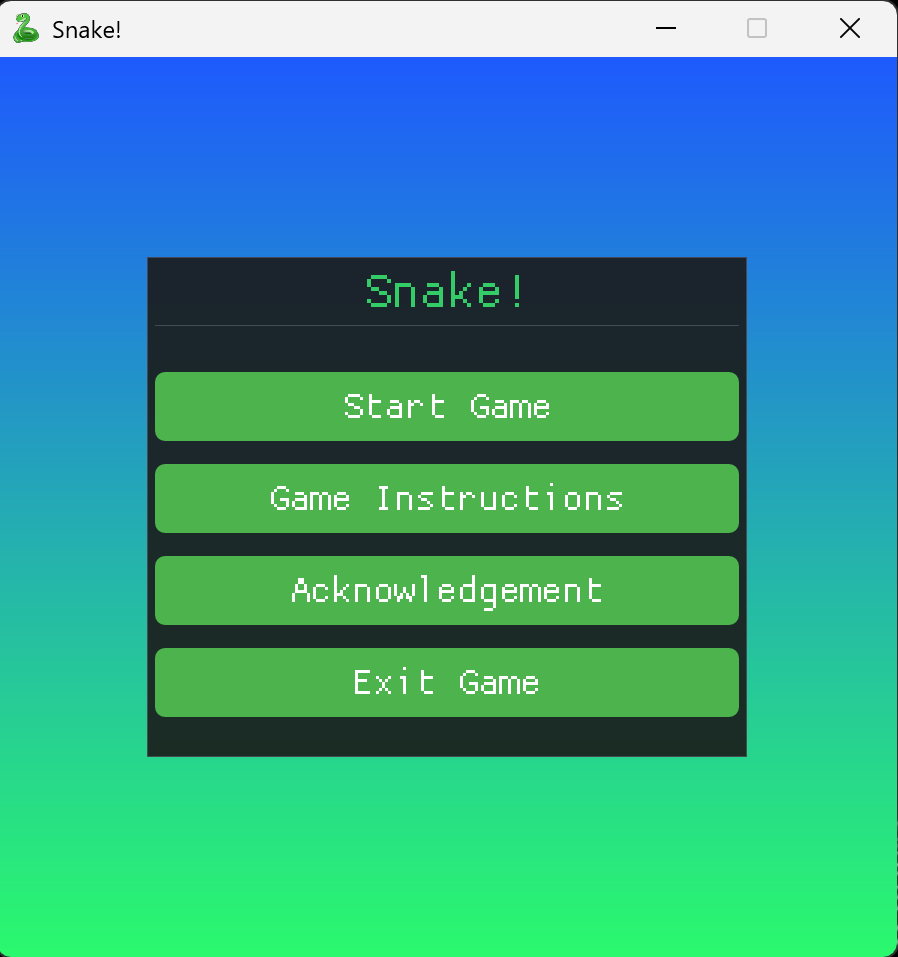

# 贪吃蛇游戏

一款由 C++ 开发的经典贪吃蛇游戏，开发环境为 Visual Studio 2022  
引用的第三方库包括 Raylib，Dear ImGui 以及 rlImGui

### 游戏特点

- **两种游戏模式**  
  普通模式和困难模式。困难模式会随机生成障碍物，且蛇的移动速度会随着长度的增加而加快

- **视觉效果**  
  - 渐变主菜单背景  
  - 死亡时产生粒子爆炸效果

- **音效**  
  - 吃食物、撞墙都有音效  
  - 内置 6 首背景音乐，支持：  
    Space 暂停/继续  A/D 上一首/下一首  W/S 音量 ±10%  
  （我已根据源文件适当调整了每首音乐的初始音量）
  
- **游戏记录**  
  两种模式的最高分会自动保存并在选模式界面显示
  
### 游戏截图

  
   
  <strong>游戏主菜单</strong>
    
  
   
  <strong>正常模式</strong>
    
  
   
  <strong>困难模式</strong>

  

> ### 特别鸣谢
> **LCQ**, **Liza**, **YSJ**, **XHR**, **HKW**, **Evgenia** ❤️  
